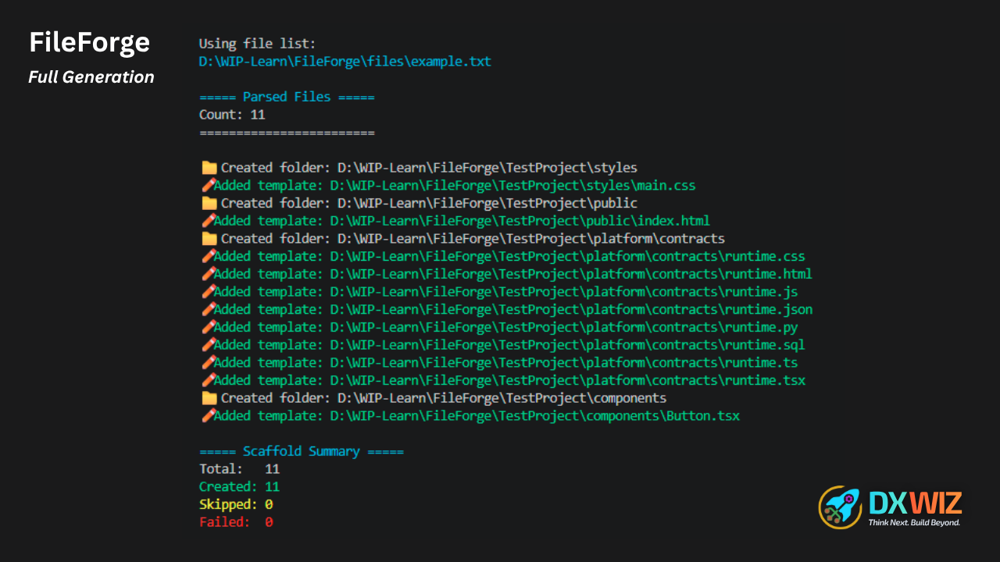
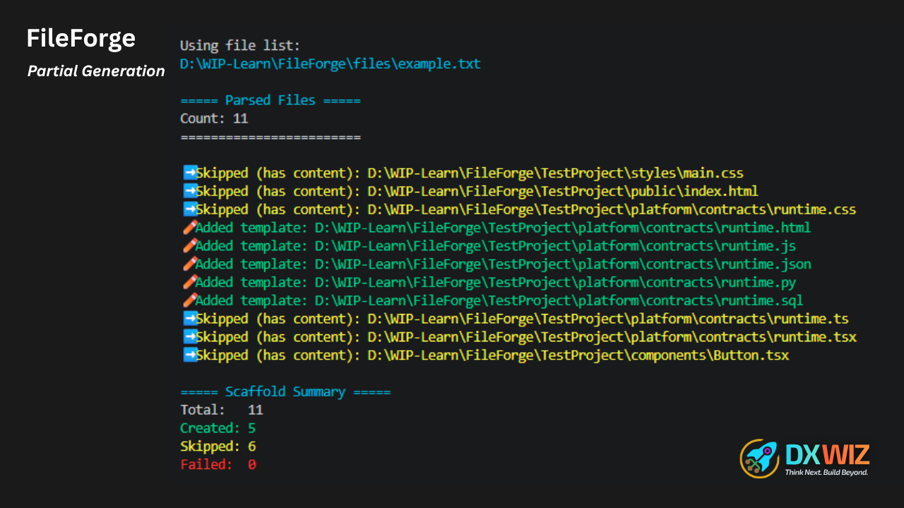
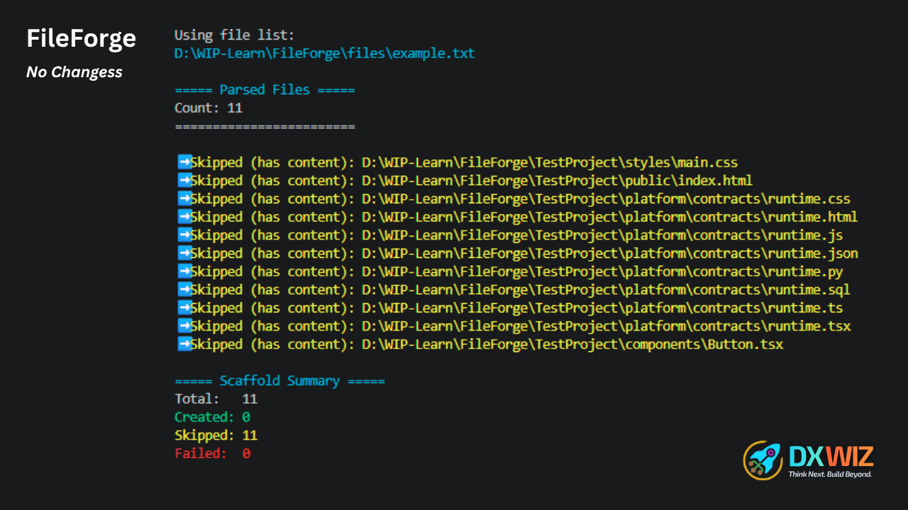
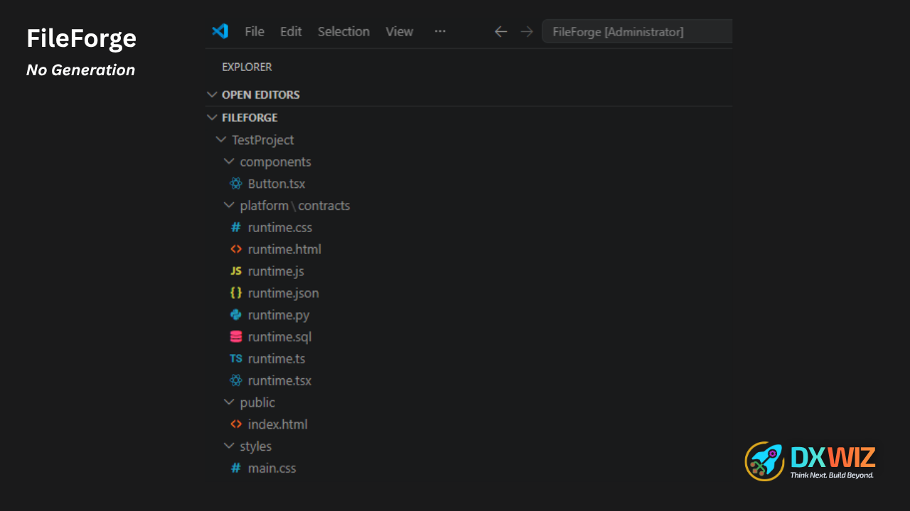
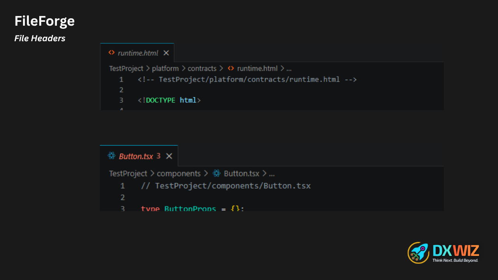

# FileForge

> A lightweight PowerShell scaffolding engine that generates project structures, files, and starter templates from reusable definitions.


FileForge helps developers create consistent project structures without manually creating folders, files, and starter templates every time.

Define your structure once, reuse it whenever you start a new project.

---

## ✨ Features

- ⚡ No installation required — simply run the PowerShell script
- 📁 Generate folders and files from simple definition files
- 🧩 Support multiple reusable project profiles
- 🎨 Apply templates automatically based on file extensions
- 📝 Automatically add file path headers to generated files
- 🛡 Protect existing work by skipping files that already contain content
- 🚫 Never overwrite existing files by default
- 📊 Display a detailed creation summary:
  - Total files
  - Created files
  - Skipped files
  - Failed files

---

# 🚀 Quick Start

## Requirements

- PowerShell 7+

Check your version:

```powershell
$PSVersionTable.PSVersion
```

Supported platforms:

- Windows
- Linux
- macOS

using PowerShell Core (`pwsh`).

---

# Generate Your First Project

Example:

```powershell
.\FileForge.ps1 `
-File react-app `
-Target "D:\Projects\MyApplication"
```

or:

```powershell
.\FileForge.ps1 -File react-app -Target "D:\Projects\MyApplication"
```

FileForge will read:

```
files/react-app.txt
```

and generate:

```
MyApplication
│
├── src
│   ├── components
│   │   └── Button.tsx
│   └── styles
│       └── main.css
│
├── public
│   └── index.html
│
└── package.json
```

---

# How It Works

FileForge uses a simple three-step process:

```
File Definition
       │
       ▼
Template Selection
       │
       ▼
File Creation
```

Example definition:

```
files/react-app.txt
```

contains:

```text
src/components/Button.tsx
src/styles/main.css
public/index.html
package.json
README.md
```

FileForge:

1. Reads the definition file
2. Creates required folders
3. Selects templates based on extensions
4. Generates the final project structure

---

# 📂 Project Structure

```
FileForge
│
├── files
│   ├── company-standard.txt
│   ├── dotnet-api.txt
│   ├── node-api.txt
│   ├── python-service.txt
│   └── react-app.txt
│
├── templates
│   ├── css.ps1
│   ├── html.ps1
│   ├── js.ps1
│   ├── json.ps1
│   ├── py.ps1
│   ├── sql.ps1
│   ├── ts.ps1
│   └── tsx.ps1
│
├── FileForge.ps1
├── Templates.ps1
├── README.md
├── LICENSE
└── HowTo.md
```

---

# 📄 File Definitions

File definitions describe the structure you want to create.

They are stored inside: `files/`

Example: `files/example.txt`

Content:

## Example Definition

The following example demonstrates:

- Full-line comments
- Inline comments
- Nested folders
- Multiple file types
- Automatic template selection

```text
# FileForge Example Definition

# Styles

TestProject/styles/main.css  # Main application stylesheet

# Public

TestProject/public/index.html

# Platform Contracts

TestProject/platform/contracts/runtime.css
TestProject/platform/contracts/runtime.html
TestProject/platform/contracts/runtime.js
TestProject/platform/contracts/runtime.json
TestProject/platform/contracts/runtime.py
TestProject/platform/contracts/runtime.sql
TestProject/platform/contracts/runtime.ts
TestProject/platform/contracts/runtime.tsx

# Components

TestProject/components/Button.tsx
```

Each line represents one folder or file path.

---

## Comments

File definitions support comments using `#`.

### Full-line comment

```text
# FileForge Example Definition

src/App.tsx
```

### Inline comment

```text
src/components/Button.tsx # Main button component
```

---

## Definition Rules

Use only plain paths.

Do not include:

❌ Quotes

```text
"src/App.tsx"
```

❌ Commas

```text
src/App.tsx,
```

❌ Additional symbols

Correct:

```text
src/components/Button.tsx
```

---

# ⚙️ Command Usage

## Run From FileForge Folder

```powershell
.\FileForge.ps1 `
-File react-app `
-Target "D:\Projects\App"
```

---

## Run From Any Location

```powershell
& "D:\Tools\FileForge\FileForge.ps1" `
-File react-app `
-Target "D:\Projects\App"
```

---

# Parameters

| Parameter | Description                                         |
| --------- | --------------------------------------------------- |
| `-File`   | Selects the definition file from the `files` folder |
| `-Target` | Defines where the generated project will be created |

Example:

```powershell
-File react-app
```

uses:

```
files/react-app.txt
```

Example:

```powershell
-Target "D:\Projects\App"
```

creates files inside:

```
D:\Projects\App
```

---

# Target Safety

If `-Target` is not provided, FileForge uses the current directory.

Because this may accidentally be the FileForge installation folder, confirmation is required.

Example:

```
⚠️ No -Target specified.
Files will be created here:
D:\Tools\FileForge

Continue? (Y/N):
```

Choosing: n

results in: ❌ Cancelled.

---

# 🎨 Templates

Templates are automatically selected based on file extension.

Supported templates:

| Extension | Template        |
| --------- | --------------- |
| `.ts`     | TypeScript      |
| `.tsx`    | React Component |
| `.js`     | JavaScript      |
| `.css`    | CSS Starter     |
| `.html`   | HTML Starter    |
| `.json`   | Empty JSON      |
| `.py`     | Python Header   |
| `.sql`    | SQL Header      |

Example:

Creating:

```
Button.tsx
```

automatically loads:

```
templates/tsx.ps1
```

---

# 🛡 Safety Behavior

FileForge is designed to protect existing projects.

## Existing Files

If a file already exists and contains content:

```
➡️ Skipped (has content)
```

The file remains unchanged.

---

## New Files

If a file does not exist:

```
✏️ Added template:

D:\Projects\App\src\Component.tsx
```

The file is created using the matching template.

---

# 📊 Summary Example

After completion:

```
===== FileForge Summary =====
Total:   13
Created: 9
Skipped: 4
Failed:  0
=============================
```

---

# 🧪 Example Profiles

Included examples:

| Profile            | Purpose                     |
| ------------------ | --------------------------- |
| `react-app`        | React application structure |
| `node-api`         | Node.js API project         |
| `dotnet-api`       | .NET API project            |
| `python-service`   | Python service structure    |
| `company-standard` | Custom company template     |

---

# 🚀 Example

## Example Definition File

```text
# FileForge Example Definition

# Styles

TestProject/styles/main.css  # Main application stylesheet

# Public

TestProject/public/index.html

# Platform Contracts

TestProject/platform/contracts/runtime.css
TestProject/platform/contracts/runtime.html
TestProject/platform/contracts/runtime.js
TestProject/platform/contracts/runtime.json
TestProject/platform/contracts/runtime.py
TestProject/platform/contracts/runtime.sql
TestProject/platform/contracts/runtime.ts
TestProject/platform/contracts/runtime.tsx

# Components

TestProject/components/Button.tsx
```

## 📸 Example Results

### ✅ Scenario 1 — New Project

If none of the folders or files exist, FileForge creates the complete project structure.



### ✅ Scenario 2 — Existing Project

If some files already exist and contain content, FileForge skips those files while creating only the missing folders and files.



### ✅ Scenario 3 — No Changes Required

If every file already exists and contains content, FileForge completes without modifying the project.



### Generated Project Structure

FileForge creates the requested folders and files while preserving the directory structure defined in the file.



### Generated File Header

When templates are used, FileForge can automatically include the generated file path as a header to help identify the file's intended location.



---

# 🗺 Roadmap

Possible future improvements:

- Preview mode (`--what-if`)
- Custom template variables
- Additional template engines
- Project metadata support
- More built-in project profiles
- Interactive project creation wizard

---

# 🤝 Contributing

Contributions are welcome.

If you improve FileForge, add templates, fix bugs, or suggest features, please consider opening an issue or pull request.

See [CONTRIBUTING](CONTRIBUTING.md) for contribution guidelines.

---

## 🏢 About

FileForge is an open-source project created and maintained by **DXWIZ**.

Learn more about DXWIZ at **[dxwiz.com](https://dxwiz.com)**.

For questions or support, visit our [Contact page](https://dxwiz.com/contact).

---

# 📜 License

FileForge is licensed under the MIT License.

See the [LICENSE](LICENSE) file for details.

---

# ⭐ Why FileForge?

Many projects begin with the same repetitive setup tasks:

- Creating folders
- Adding standard files
- Preparing starter templates
- Maintaining consistent structures

FileForge turns those repeated steps into reusable definitions.

Define once.

Generate anytime.

---
